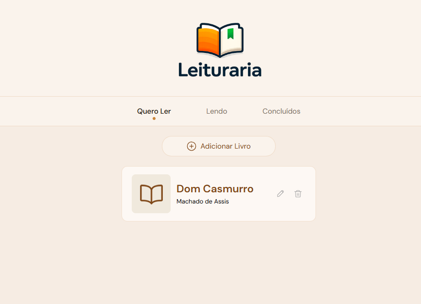

# 📚 Leituraria

Aplicação web para organizar sua lista de leitura, desenvolvida com React. Permite cadastrar livros e acompanhar seu progresso de leitura em três categorias: **Quero Ler**, **Lendo** e **Concluídos**.

---

## ✨ Funcionalidades

- 📖 Cadastrar livros com título, autor e status
- ✏️ Editar informações de um livro
- 🗑️ Excluir livros com confirmação
- 🔖 Filtrar livros por status de leitura
- 💾 Persistência de dados no `localStorage`
- 🔔 Notificações de feedback (Toast) para cada ação
- 📋 Livros pré-cadastrados carregados por padrão

---

## 🛠️ Tecnologias

- [React](https://react.dev/)
- [Vite](https://vitejs.dev/)
- Context API
- localStorage
- CSS puro

---

## 📁 Estrutura do projeto

```
src/
├── components/
│   ├── BookForm/         # Formulário de cadastro e edição
│   ├── BookList/         # Lista de livros
│   ├── BookProvider/     # Context API (estado global)
│   │   ├── index.jsx     # Provider com a lógica
│   │   └── BookContext.js
│   ├── Button/           # Botão reutilizável
│   ├── CardBook/         # Card individual de livro
│   ├── ConfirmDialog/    # Dialog de confirmação de exclusão
│   ├── Container/
│   ├── ContainerHeader/
│   ├── Dialog/           # Modal genérico
│   ├── Header/
│   ├── Logo/
│   ├── Navbar/           # Navegação com active link
│   ├── SelectField/      # Campo select reutilizável
│   ├── TextInput/        # Campo input reutilizável
│   ├── Toast/            # Notificação de feedback
│   └── icons/            # Ícones SVG customizados
├── App.jsx
├── App.css
├── main.jsx
└── index.css
```

---

## 🚀 Como rodar o projeto

**Pré-requisitos:** Node.js instalado

```bash
# Clone o repositório
git clone https://github.com/seu-usuario/leituraria.git

# Entre na pasta
cd leituraria

# Instale as dependências
npm install

# Rode o projeto
npm run dev
```

Acesse em: `http://localhost:5173`

---

## 📸 Preview



---

## 📝 O que aprendi neste projeto

- Componentização e reutilização de componentes
- Gerenciamento de estado com `useState` e `useEffect`
- Context API para estado global
- Persistência com `localStorage`
- Formulários controlados no React
- CRUD completo (criar, ler, atualizar, deletar)
- Criação de ícones SVG customizados
- Feedback visual com Toast notifications

---

## 👨‍💻 Autor

Feito por **Guilherme** durante o curso de React da [Alura](https://www.alura.com.br/).
